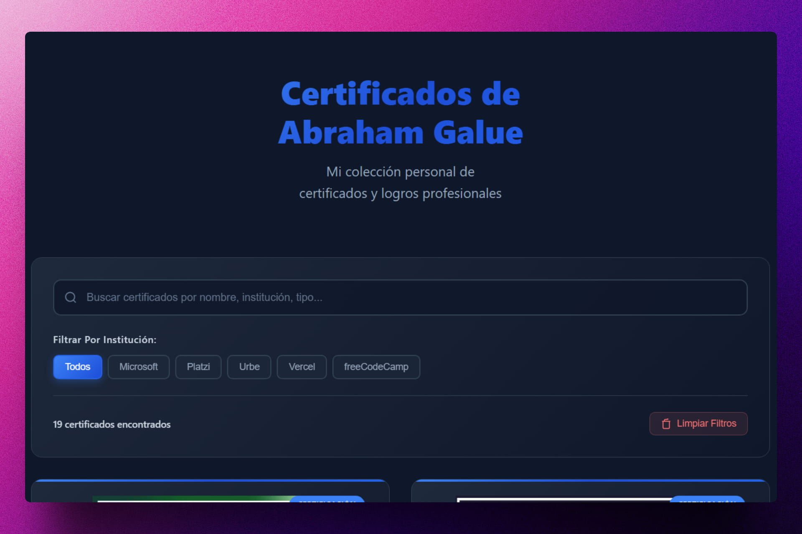
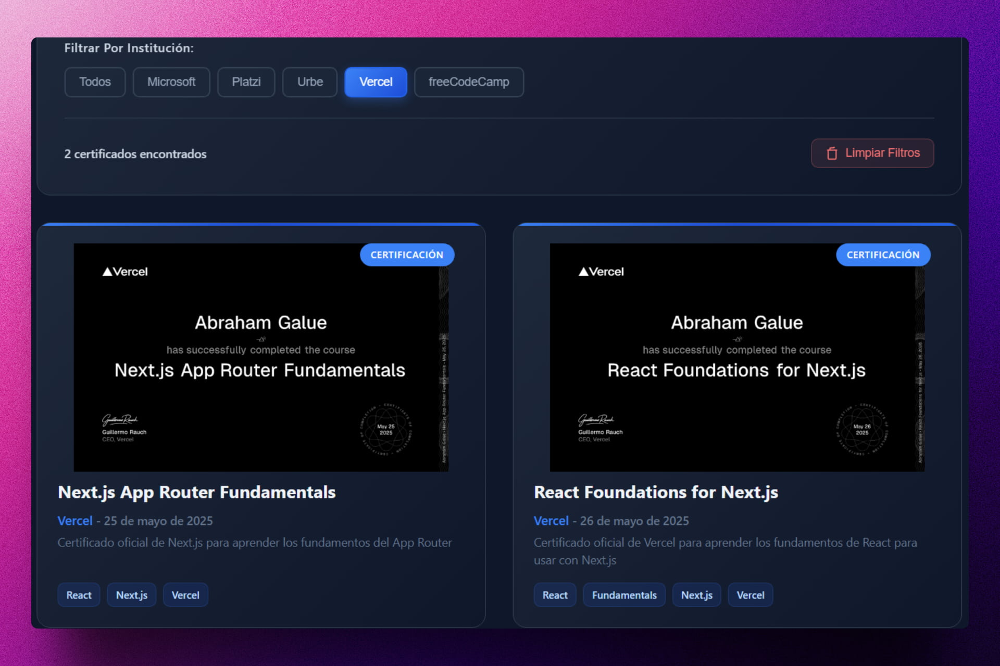

<div align='center'>

# 🚀 Astro: Personal Certificates

</div>

[English Readme](README.md)

### Página que contiene mis certificados personales.

> 🧩 Aquí puedes ver su [**Live Demo**](https://abrahamgalue-certificates.netlify.app/).






## 🚀 Descripción

Este proyecto te permite mostrar tus certificados personales de manera atractiva y organizada. Está construido con **Astro**, un framework moderno para crear sitios web rápidos y optimizados.

Puedes agregar tus certificados en formato PDF y personalizar la apariencia del sitio web para que se adapte a tu estilo.

## ⚡ Comenzar

### Prerrequisitos

1. Git.
2. Node.js 22 o superior.
3. pnpm (opcional, puedes usar npm o yarn).

## 🔧 Instalación

### Usando pnpm

1. **Clona el repositorio:**

   ```bash
   git clone https://github.com/abrahamgalue/personal-certificates.git
   cd personal-certificates
   ```

2. **Instala las dependencias:**

   ```bash
   pnpm install
   ```

3. **Inicia el servidor de desarrollo:**

   ```bash
   pnpm dev
   ```

4. **Abre tu navegador y visita:**

   ```bash
   http://localhost:4321
   ```

## ✨ Cómo agregar certificados

Si deseas utilizar este sitio para mostrar tus propios certificados, sigue estos sencillos pasos:

1. **Configura los datos**:
   - Crea un archivo llamado `certificates.json` en la carpeta `src/data/`.
   - Copia y sigue la estructura de `src/data/example.json`.

2. **Agrega los archivos**:
   - Guarda los archivos **.pdf** de tus certificados en `public/certificates/`.
   - Guarda las **imágenes de vista previa** en `src/assets/`. Se recomienda usar el formato `.webp`.

3. **Verifica los nombres**:
   - El nombre del archivo PDF y de la imagen de vista previa **debe coincidir exactamente** con la propiedad `filename` definida en tu archivo `certificates.json`.

4. **Configuración de imágenes (Opcional)**:
   - Por defecto, el proyecto busca imágenes con extensión `.webp`. Si usas otro formato, cámbialo en `src/components/Certificates.astro` (aprox. línea 40):
     ```astro
     imagePath={`/src/assets/${certificate.filename}.webp`}
     ```

5. **Actualizaciones futuras**:
   - Para añadir más certificados después de la configuración inicial, solo necesitas agregar el nuevo objeto al JSON y subir los archivos correspondientes a las carpetas mencionadas.

## 🎭 Tecnologías

- [**Astro**](https://astro.build/) Framework para construir sitios web rápidos.
