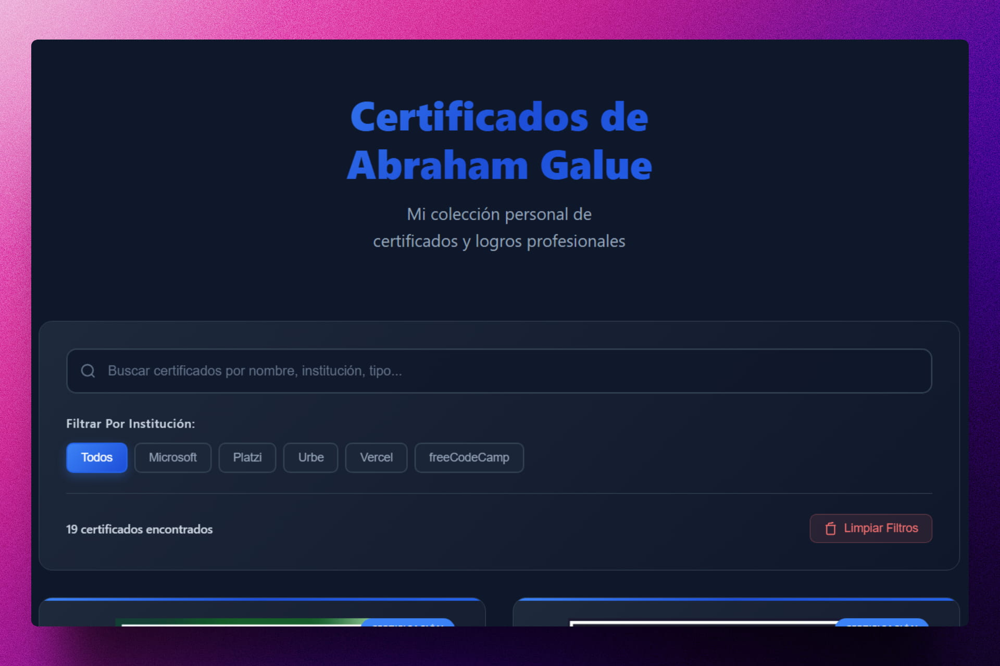
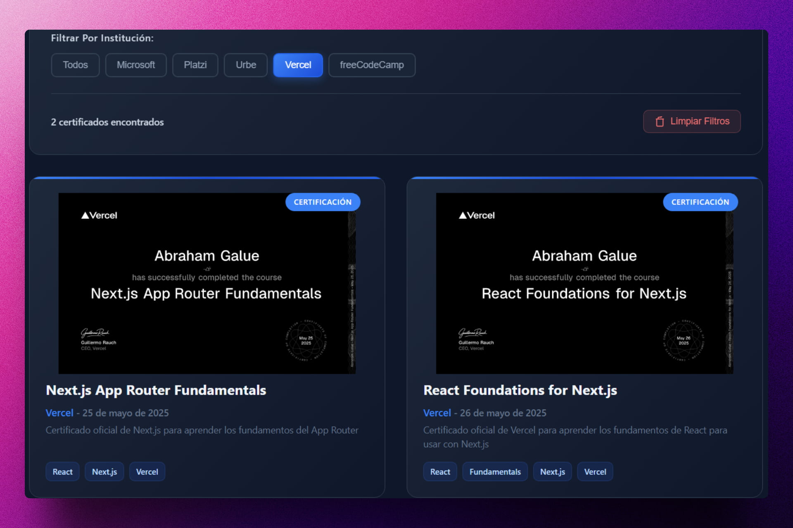

<div align='center'>

# 🚀 Astro: Personal Certificates

</div>

### Página que contiene mis certificados personales.

> 🧩 Aquí puedes ver su [**Live Demo**](https://abrahamgalue-certificates.netlify.app/).






## 🚀 Descripción

Este proyecto te permite mostrar tus certificados personales de manera atractiva y organizada. Está construido con **Astro**, un framework moderno para crear sitios web rápidos y optimizados.

Puedes agregar tus certificados en formato PDF y personalizar la apariencia del sitio web para que se adapte a tu estilo.

## ⚡ Comenzar

### Prerrequisitos

1. Git.
2. Node.js 20 o superior.
3. pnpm (opcional, puedes usar npm o yarn).

## 🔧 Instalación

### Usando pnpm

1. **Clona el repositorio:**

   ```bash
   git clone https://github.com/abrahamgalue/personal-certificates.git
   cd personal-certificates
   ```

2. **Instala las dependencias:**

   ```bash
   pnpm install
   ```

3. **Inicia el servidor de desarrollo:**

   ```bash
   pnpm dev
   ```

4. **Abre tu navegador y visita:**

   ```bash
   http://localhost:4321
   ```

## 🎭 Tecnologías

- [**Astro**](https://astro.build/) Framework para construir sitios web rápidos.
